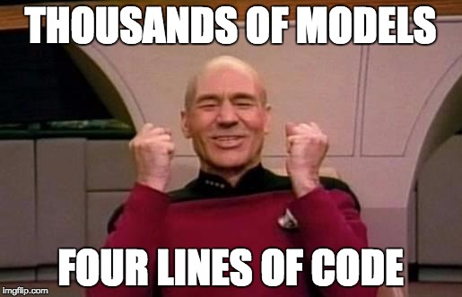

```{r setup, include=FALSE}
knitr::opts_chunk$set(cache = FALSE)
library(knitr)
```

# Hello

## Announcement: We Are Moving

- Session 5, 1/24: **E62-223**
- Session 6, 1/26: **E51-325**
- Session 7, 1/31: **E62-223**
- Session 8, 2/2:  **E51-325**

# Advanced Topics in Data Science

## Session Titles

### "Don't Write For Loops"

### "Be Lazy"

### "Stupid Data Frame Tricks"

### **"Advanced Topics in Data Science"**


<!-- ## Exercise -->

<!-- Fire up RStudio, load the `tidyverse` package, and read in our main data set for the day.  -->

<!-- ```{r} -->
<!-- library(tidyverse) -->
<!-- prices <- read_csv('data/price_calendar.csv') # tidy version of read.csv() -->
<!-- prices %>% head(5) -->
<!-- ``` -->

<!-- ## Exercise -->
<!-- Pair up with the person next to you and answer the following questions about the `prices` table:  -->

<!-- 1. How many **rows of data** are missing in the `price_per` column?  -->
<!-- 2. How many **listing_ids** have complete data in the time period?  -->

<!-- Lots of approaches. Some useful functions: `is.na`, `group_by`, `summarise`, `nrow()`, `unique()`, `n_distinct()`.  -->

<!-- # In English, what did you calculate?  -->


<!-- ## Sample answers {.build .smaller} -->

<!-- Compute the number of rows with NA values in the `price_per` column:  -->
<!-- ```{r} -->
<!-- n_missing_1 <- prices$price_per %>% is.na() %>% sum() -->
<!-- ``` -->

<!-- Compute the number of listings with no NA values in any of their rows.  -->
<!-- ```{r} -->
<!-- complete_listings_1 <- prices %>%  -->
<!-- 	group_by(listing_id) %>%  -->
<!-- 	summarise(num_na = sum(is.na(price_per))) %>% -->
<!-- 	filter(num_na == 0) %>%  -->
<!-- 	nrow() -->
<!-- ``` -->


<!-- These solutions capture data that's **explicitly** listed as `NA` in the `prices` tibble.  -->
<!-- But what about data that wasn't collected, or that someone forgot to enter...? It's **implicitly** missing.  -->

<!-- # Types of Missing Data -->

<!-- ## Complete Data -->

<!-- ```{r, fig.margin = T, echo = FALSE} -->
<!-- data.frame(group_1 = c('1', '1', '2', '2'),  -->
<!-- 		   group_2 = c('a', 'b', 'a', 'b'),  -->
<!-- 		   value = c(5.4, 4.7, 9.0, 8.1)) %>%  -->
<!-- 	kable() -->
<!-- ``` -->

<!-- ## Explicitly Missing Data -->
<!-- ```{r, echo = FALSE} -->
<!-- data.frame(group_1 = c('1', '1', '2', '2'),  -->
<!-- 		   group_2 = c('a', 'b', 'a', 'b'),  -->
<!-- 		   value = c(5.4, 4.7, 9.0, NA)) %>%  -->
<!-- 	kable() -->
<!-- ``` -->

<!-- ## Implicitly Missing Data -->

<!-- ```{r, echo = FALSE} -->
<!-- data.frame(group_1 = c('1', '1', '2'),  -->
<!-- 		   group_2 = c('a', 'b', 'a'),  -->
<!-- 		   value = c(5.4, 4.7, 9.0)) %>%  -->
<!-- 	kable() -->
<!-- ``` -->

<!-- ## How much of our data is **implicitly missing?** -->
<!-- ```{r} -->
<!-- n_listings <- n_distinct(prices$listing_id)  -->
<!-- n_dates    <- n_distinct(prices$date) -->

<!-- n_listings * n_dates  - nrow(prices) -->
<!-- ``` -->

<!-- ## Making Implicitly Missing Data Explicit -->

<!-- ```{r, eval = FALSE} -->
<!-- implicitly_missing %>%  -->
<!-- 	tidyr::complete(group_1, group_2) %>%  -->
<!-- 	kable() -->
<!-- ``` -->

<!-- ```{r, echo = FALSE}  -->
<!-- data.frame(group_1 = c('1', '1', '2'),  -->
<!-- 		   group_2 = c('a', 'b', 'a'),  -->
<!-- 		   value = c(5.4, 4.7, 9.0)) %>%  -->
<!-- 	tidyr::complete(group_1, group_2) %>% -->
<!-- 	kable() -->
<!-- ``` -->

<!-- ## With our data -->

<!-- ```{r} -->
<!-- ### <b> -->
<!-- prices <- prices %>% complete(listing_id, date) -->
<!-- ###</b> -->
<!-- n_listings <- n_distinct(prices$listing_id)  -->
<!-- n_dates    <- n_distinct(prices$date) -->

<!-- n_listings * n_dates  - nrow(prices) -->
<!-- ``` -->

<!-- Now the previous solutions will quantify both implicit and explicitly missing data.  -->

<!-- ## Revisiting our solutions {.smaller} -->


<!-- Compute the number of rows with NA values in the `price_per` column:  -->
<!-- ```{r} -->
<!-- n_missing_2 <- prices$price_per %>% is.na() %>% sum() -->
<!-- n_missing_1 - n_missing_2 -->
<!-- ``` -->

<!-- Compute the number of listings with no NA values in any of their rows.  -->
<!-- ```{r} -->
<!-- complete_listings_2 <- prices %>%  -->
<!-- 	group_by(listing_id) %>%  -->
<!-- 	summarise(num_na = sum(is.na(price_per))) %>% -->
<!-- 	filter(num_na == 0) %>%  -->
<!-- 	nrow() -->

<!-- complete_listings_2 - complete_listings_1 -->
<!-- ``` -->


<!-- ## Moral -->

<!-- - Your data may not be as complete as you think it is.  -->
<!-- - Being **explicit** about your data limitations allows you to design analysis and communicate honestly about your findings.  -->
<!-- - `R` includes simple tools like `tidyr::complete()` that allow you to **easily perform complex, practical data science tasks.**  -->

<!-- ## Now that we've been careful... -->

<!-- ... we can exlude NA entries.  -->

<!-- ```{r} -->
<!-- prices <- prices %>% na.omit() -->
<!-- ``` -->

## Gameplan {.build}

<div class="columns-2">

- **Synthesize** techniques from Sessions 2 and 3.
- Work through an example of the **(data-)scientific method.** 
- Learn key tools for building **complex data pipelines** from simple building blocks.
- ***Impress Patrick Stewart:***

```{r, out.height = 300, echo = FALSE}

```

</div>

## The Data Science Pipeline {.build}

```{r, out.height = 300, echo = FALSE}
knitr::include_graphics('https://ismayc.github.io/moderndiver-book/images/tidy1.png')
```
(*Image credit: Hadley Wickham*)

The **tidyverse** is a set of packages by Hadley that helps manage each stage of this pipeline. 

## What we've practiced already {.build}

- Import -> tidy -> transform
- Import -> tidy -> transform -> model
- Import -> tidy -> transform -> visualize

But....
```{r, out.height = 300, echo = FALSE}
knitr::include_graphics('https://ismayc.github.io/moderndiver-book/images/tidy1.png')
```

## Exercise 0

1. Look left
2. Look right
3. Pick a partner (groups of three are fine)

You are going to need them soon. 

# Case Study, Part 1

1. *Explore the data*
2. *Ask a question*
3. *Form a hypothesis*

```{r, echo = FALSE, warning = FALSE, message=FALSE}
library(tidyverse)
source('load_data.R')
```

## What we'd like to do

```{r, out.height = 100, out.width = 700, echo = FALSE}
knitr::include_graphics('figs/journey_1.png')
```

## Fitting a Single Model

We'd like to fit a LOESS smoother to the data to capture long-term trend. We can fit a single one like this: 

```{r}
model_data <- prices %>%       # extract a single listing's 
	filter(listing_id == 5506) # worth of data

# fit a loess model, the span is a hyperparameter, a bit 
# like lambda in LASSO
single_model <-  loess(price_per ~ as.numeric(date),  
					   data = model_data, 
					   span = .5)
```

## Examining a Single Model {.smaller}

```{r}
single_model %>% summary()
```

## Model Information the Tidy Way

```{r}
model_preds <- broom::augment(single_model, model_data) 
model_preds %>% head()
```

## Visualizing a Single Model {.build}

```{r, fig.height = 4}
model_preds %>%
	ggplot(aes(x = date)) + 
	geom_line(aes(y = price_per)) + 
	geom_line(aes(y = .fitted), color = 'red')
```

## How do we do this for multiple models? 

```{r, eval = FALSE}
model_container <- ????
for(id in unique(prices$listing_id)){
	model <- prices %>% 
		filter(listing_id == id) %>% 
		loess(price_per ~ as.numeric(date),
			  data = .,
			  span = .25)
	
	model_container %>% update(model) # ?????
	.
	.
	.
}
```

## For loops...

```{r, echo = FALSE, out.height = 400, out.width = 600}

```

## A familiar loop

```{r}
my_list <- list('Computing', 'in', 'Optimization', 'and' ,'Statistics')

###<b>
length_list <- list()
i           <- 1
for(word in my_list){
	length_list[i] <- nchar(word)
	i              <- i + 1
}
###</b>

length_list %>% unlist() # just for display
```

## A better way:

```{r}
my_list <- list('Computing', 'in', 'Optimization', 'and' ,'Statistics')

### <b> 
length_list <- map(my_list, nchar) # or my_list %>% map(nchar)
###</b>

length_list %>% unlist() # just for display
```

`purrr::map()` applies a function (`nchar`) to each entry of the original list. 

## Exercise {.build}

The directory `exercise_data` contains price data for each month. Use `map` to read it in efficiently, and `reduce(rbind)` to combine it all together. Use `list.files('exercise_data', full.names = T)` to get a list of all the files. 

```{r}
list.files('exercise_data', full.names = T) %>% 
	map(read_csv) %>% 
	reduce(rbind) %>%
	head() # just for display
```

## Fundamental Pattern

**Use lists of data frames (and data frames of lists) to organize your work.**


## Why?

**Data frames are the fundamental unit of data science**. 

Usually their columns are **atomic vectors** of integers, doubles, dates, characters, or booleans. E.g. 

```{r, echo = FALSE}
head(prices)
```

But this is somewhat inflexible. What about more complex objects? Lists can hold anything...

## Well if lists are so great...

```{r, echo = FALSE, out.height=400, out.width = 650}
knitr::include_graphics('figs/list_df.jpg')
```

## That's a good idea! 

```{r}
prices_nested <- prices %>% 
	tidyr::nest(-listing_id)

# view the data types of the columns
map(prices_nested, class) %>% unlist()
```

## Ew. 

```{r, echo = FALSE, out.height=400, out.width = 450}
knitr::include_graphics('figs/df_list.jpg')
```

## Actually...

```{r}
prices_nested %>% head()
```

## WELP

```{r, echo = FALSE, out.height=500, out.width = 700}

```

## Just checking

```{r}
prices_nested$data[[1]] # get the first item of the list
```

## We were here: 

```{r, out.height = 100, out.width = 700, echo = FALSE}
knitr::include_graphics('figs/journey_1.png')
```

## Now we're here:

```{r, out.height = 300, out.width = 700, echo = FALSE}
knitr::include_graphics('figs/journey_2.png')
```

## Exercise {.build}

Use `map` to extract a list of lengths of each data frame in `prices_nested$data`

```{r, eval = FALSE}
### <b> 
lengths <- map(prices_nested$data, nrow)
### </b>
lengths %>% unlist() %>% head() # for display only
```

```{r, echo = FALSE}
map(prices_nested$data, nrow) %>% unlist() %>% head()
```

## Exercise {.build}

Write a function that extracts the largest price (per person) from a data frame. 

```{r}
get_biggest_price <- function(data){
	data$price_per %>% max(na.rm = T)
}
```

Now `map` to extract the largest price in each data frame in `prices_nested$data`: 

```{r}
### <b> 
biggest_prices <- map(prices_nested$data, get_biggest_price)
### </b>
biggest_prices %>% head() %>% unlist()
```

## Exercise {.build}

Now do the same thing, but assign the result to a *new list column* of `prices_nested`. Don't forget what you learned in Session 2! 
 
```{r, eval = FALSE}
prices_nested %>% 
	mutate(highest_price = map(data, get_biggest_price))
```

```{r, echo = FALSE}
prices_nested %>%
	mutate(highest_price = map(data, get_biggest_price)) %>% 
	head(5)
```

## Exercise

Now do the same thing, but assign the result to a *new list column* of `prices_nested`. Don't forget what you learned in Session 2! 
 
```{r, eval = FALSE}
prices_nested %>% 
	### <b> 
	mutate(highest_price = map_dbl(data, get_biggest_price))
	### </b>
```

```{r, echo = FALSE}
prices_nested %>%
	
	mutate(highest_price = map_dbl(data, get_biggest_price)) %>% 
	
	head(5)
```

## Summing Up

We know how to: 

1. **Nest** a data frame, creating a **list of data frames**.
2. Use `map` to apply a function to every element of a list. 
3. Apply a model function to an individual data frame (from Session 3).

Looks like it's time for...

# Case Study, Part 2

1. Fit many models
2. Learn from results
3. Ask new questions

## We were here: 

```{r, out.height = 300, out.width = 700, echo = FALSE}
knitr::include_graphics('figs/journey_2.png')
```

## Then we did this: 

```{r, out.height = 300, out.width = 700, echo = FALSE}
knitr::include_graphics('figs/journey_3.png')
```

## Now we're here: 

```{r, out.height = 300, out.width = 700, echo = FALSE}
knitr::include_graphics('figs/journey_4.png')
```


## 

```{r, echo = FALSE, out.height=500, out.width = 700}

```


## In code 

```{r, eval = FALSE}

my_loess <- function(data, span){
	loess(price_per ~ as.numeric(date),
	data = data, 
	span = span)
}

prices_nested <- prices %>% 
	nest(-listing_id) 

prices_modeled <- prices_nested %>% 
	mutate(model = map(data, my_loess, span = .25))

prices_with_preds <- prices_modeled %>% 
	mutate(preds = map2(model, data, augment))

prices_unnested <- prices_with_preds %>% 
	unnest(preds)

```

## More concise with %>% 

```{r, eval = FALSE}

my_loess <- function(data, span){
	loess(price_per ~ as.numeric(date),
	data = data, 
	span = span)
}

prices_unnested <- prices %>% 
	nest(-listing_id) %>% 
	mutate(model = map(data, my_loess, span = .25),
		   preds = map2(model, data, augment)) %>% 
	unnest(preds)

```

## Even more concise {.smaller .build}

A little syntactic sugar ([reference](http://r4ds.had.co.nz/lists.html)) 

```{r, eval = FALSE}
prices_unnested <- prices %>% 
	nest(-listing_id) %>% 
	mutate(model = map(data, ~loess(price_per ~ as.numeric(date), data = ., span = .25)),
		   preds = map2(model, data, augment)) %>% 
	unnest(preds)
```

## 

```{r, echo = FALSE, out.height=500, out.width = 700}

```

## Thousands of models, four lines {.smaller}


```{r, eval = FALSE}
prices_unnested <- prices %>% 
	nest(-listing_id) %>% 
	mutate(model = map(data, ~loess(price_per ~ as.numeric(date), data = ., span = .25)),
		   preds = map2(model, data, augment)) %>% 
	unnest(preds)
```

Four nontrivial lines: 

1. **Nest** the data...
2. ...Fit a collection of the models to the data (**map**)...
3. ...**Augment** the data with the model predictions... 
4. ...**Unnest** the data...

...and now we're ready to explore the results. 

## The Data Science Pipeline {.build}

```{r, out.height = 300, echo = FALSE}
knitr::include_graphics('https://ismayc.github.io/moderndiver-book/images/tidy1.png')
```

# Case Study Part 3

1. Fit many models
2. Learn from results
3. Ask new questions

## Finally...

```{r, out.height = 300, echo = FALSE}
knitr::include_graphics('http://www.reactiongifs.us/wp-content/uploads/2013/08/picard_clapping.gif')
```

# Reference

## Learn More About Our Packages
- Illustrative vignettes for [`purrr`](https://github.com/hadley/purrr/blob/master/README.md) and [`broom`](https://cran.r-project.org/web/packages/broom/vignettes/broom_and_dplyr.html).
- Jenny Bryan's Stat 545 course [website](http://stat545.com/syllabus.html) has excellent coverage of all our `R` topics, including [`purrr`](http://stat545.com/cm103_list-inspection-mapping.html).
- Our K-means example borrowed a lot from this `broom` [vignette](https://cran.r-project.org/web/packages/broom/vignettes/kmeans.html).

## More on the Tidyverse

- [*R For Data Science*](http://r4ds.had.co.nz/index.html) is a book by Garrett Grolemund and Hadley Wickham that goes deep into a complete suite of tools for the data science pipeline. 

## Other "Advanced Topics in Data Science"

- Automating long data science pipelines with GNU [`make`](http://stat545.com/automation04_make-activity.html).
- Literate programming with [RMarkdown](http://rmarkdown.rstudio.com/). These slides, as well as the "pretty" lecture notes, were made in `R`!
- Interactive data applications with [Shiny](https://shiny.rstudio.com/)
- Develop your own `R` [packages](http://r-pkgs.had.co.nz/). 
- Structure of the `R` language -- check out [Advanced R](http://adv-r.had.co.nz/).
